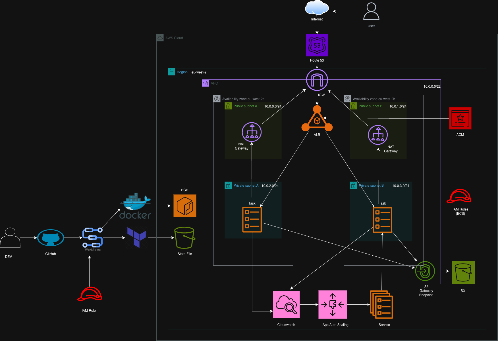
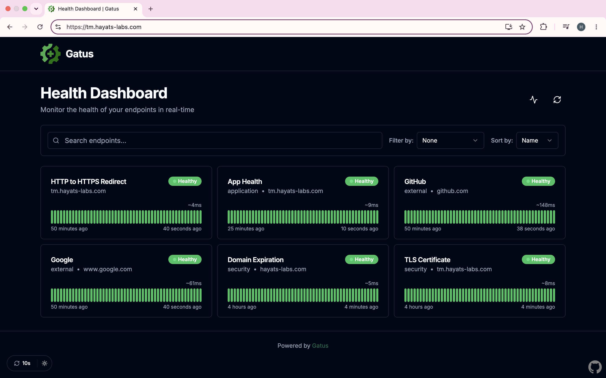
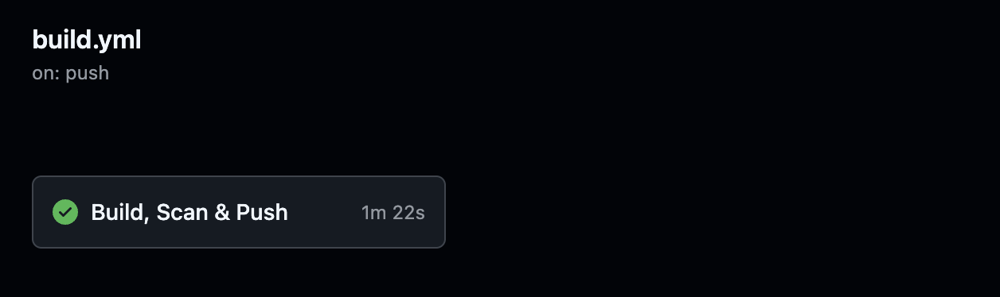
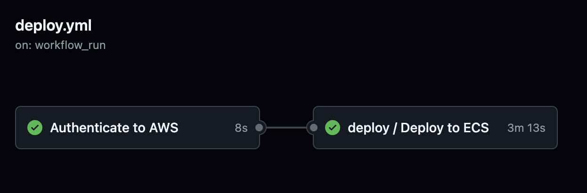
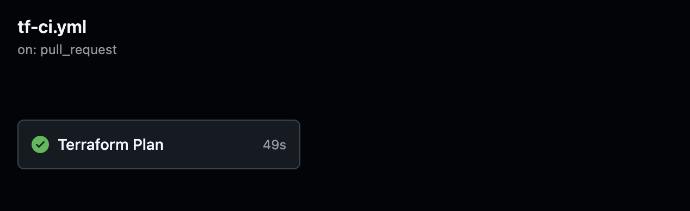
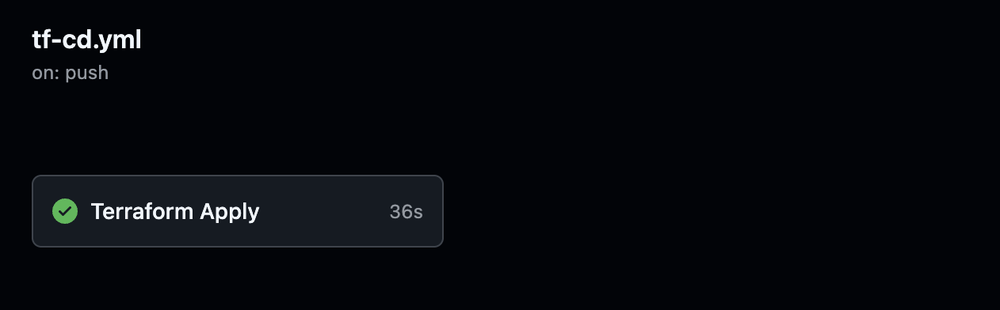
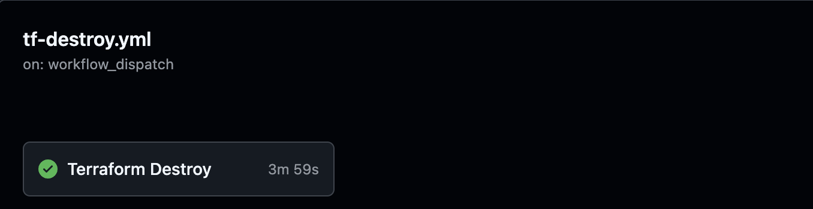

# Gatus ECS Deployment

## Project Overview

In this project, I deployed Gatus, an open-source health monitoring application that continuously checks endpoint availability, response times, and TLS certificate validity. The application is containerised using hardened Chainguard images and deployed on AWS ECS Fargate behind an Application Load Balancer across multiple Availability Zones for high availability. The infrastructure is fully defined in Terraform, while build, vulnerability scanning, and deployment are automated through OIDC-authenticated CI/CD pipelines, eliminating the need for long-lived AWS credentials.

I chose ECS Fargate because it removes the operational overhead of managing and patching EC2 instances. For a small, containerised monitoring application that needs to run across multiple Availability Zones, Fargate provides a low-maintenance, serverless container platform where AWS manages the underlying compute infrastructure and scaling.

## AWS Components

- **ECS Fargate** - runs the Gatus containers as serverless tasks
- **Application Load Balancer** - terminates HTTPS, redirects HTTP to HTTPS, and routes traffic to a target group that load-balances across the ECS tasks
- **VPC** -  network spanning 2 Availability Zones. Public subnets hold the ALB and NAT Gateway; private subnets hold the ECS tasks, keeping them isolated from direct internet access
- **Internet Gateway** -  provides internet access for the public subnets
- **NAT Gateway** -  gives private-subnet ECS tasks outbound internet access (ECR API calls, reaching monitored endpoints) without exposing them to inbound traffic
- **S3 Gateway Endpoint** -  private route to S3 so ECS pulls image layers without that traffic leaving the VPC
- **Security Groups** -  instance-level firewalls controlling traffic to the ALB and ECS tasks
- **Application Auto Scaling** - adjusts the ECS service's desired count based on CPU utilisation
- **Route53** -  DNS hosted zone and records for the custom domain
- **ACM** - TLS certificate enabling HTTPS on the ALB
- **ECR** -  private registry storing the Gatus container images
- **CloudWatch Logs** - centralised logs from the ECS tasks
- **Application Auto Scaling** -  scales the ECS service based on CPU
- **IAM** -  OIDC-based roles with least-privilege permissions for the pipelines, plus task execution and task roles for ECS

## Architecture Diagram



### HTTPS Enabled



### Live Demo


## Local Setup

**Prerequisites:** AWS account, Terraform, AWS CLI (configured via `aws configure`), Docker, and a Route53 hosted zone.

### 1. Clone the Repo
```bash
git clone https://github.com/Hayat-osman/gatus-ecs-project.git
cd gatus-ecs-project
```

### 2. Create the Terraform State Bucket
Create your S3 state bucket manually in the AWS Console. Ensure you:
* Block all public access
* Enable versioning
* Enable encryption
* Reference this bucket name in your `infra/backend.tf` file.

### 3. Build and Push the Docker Image
Build and push your Gatus container image to Amazon ECR manually before the first deploy.

1. Authenticate your local Docker client to your ECR registry:
   ```bash
   aws ecr get-login-password --region <your-region> | docker login --username AWS --password-stdin <your-account-id>.dkr.ecr.<your-region>.amazonaws.com
   ```
2. Build, tag, and push your image:
   ```bash
   docker build -t gatus-image .
   docker tag gatus-image:latest <your-account-id>.dkr.ecr.<your-region>.amazonaws.com/<your-ecr-repo>:latest
   docker push <your-account-id>.dkr.ecr.<your-region>.amazonaws.com/<your-ecr-repo>:latest
   ```

### 4. Deploy the Infrastructure
Navigate to the infrastructure directory and deploy. You must pass your ECR image URI as an environment variable since it is supplied at runtime.

```bash
cd infra
terraform init

# Export your image URI
export TF_VAR_container_image="<your-account-id>.dkr.ecr.<your-region>.amazonaws.com/<your-ecr-repo>:latest"

# Review and apply changes
terraform plan
terraform apply
```

### 5. Destroy the Infrastructure
To tear down all AWS resources directly from your local terminal:

```bash
cd infra
export TF_VAR_container_image="<your-account-id>.dkr.ecr.<your-region>.amazonaws.com/<your-ecr-repo>:latest"
terraform destroy
```

## Project Structure

```
gatus-ecs-project/
├── .github/
│   └── workflows/
│       ├── build.yml
│       ├── deploy.yml
│       ├── reusable-ecs-deploy.yml
│       ├── pr-scan.yml
│       ├── tf-ci.yml
│       ├── tf-cd.yml
│       └── tf-destroy.yml
├── app/
├── bootstrap/
├── infra/
│   ├── modules/
│   │   ├── acm/
│   │   ├── alb/
│   │   ├── autoscaling/
│   │   ├── cloudwatch/
│   │   ├── dns/
│   │   ├── ecs/
│   │   ├── iam/
│   │   ├── security_groups/
│   │   └── vpc/
│   ├── backend.tf
│   ├── data.tf
│   ├── locals.tf
│   ├── main.tf
│   ├── outputs.tf
│   ├── provider.tf
│   ├── terraform.tfvars
│   └── variables.tf
├── .dockerignore
├── .gitignore
├── .pre-commit-config.yaml
├── Dockerfile
├── LICENSE
├── README.md
└── config.yaml
```

## Docker

- **Multi-stage build** reducing the final image size by 93% (738 MB → 51.3 MB)
- **Chainguard hardened images** (Go builder and static runtime) providing a minimal, distroless, non-root, zero-CVE base image that reduces the container attack surface
- **Layer caching** optimised by copying dependency files before source code
- **Immutable git commit SHA tagging** for deployment traceability and rollbacks

## Terraform

- **Modular design** with 9 reusable modules (VPC, ALB, ECS, IAM, ACM, DNS, CloudWatch, autoscaling, security groups), following DRY principles
- **Remote state in S3** with a hardened bucket: encryption at rest, versioning, all public access blocked, and HTTPS-only enforced
- **S3 native state locking** (`use_lockfile = true`), removing the need for a separate DynamoDB lock table

- **Separate state files** for the bootstrap (`gatus/bootstrap`) and infrastructure (`gatus/dev`), keeping their state isolated
- **Bootstrap pattern** provisioning the OIDC provider and IAM roles outside the main stack, so a destroy in /infra can never remove the state backend or credentials

- **Lifecycle blocks** (`ignore_changes`) on the task definition (ignoring the image) and the service (ignoring desired count), so the CI/CD pipeline can update the deployed image and Application Auto Scaling can adjust the running task count without Terraform reverting either on the next apply

- **Committed non-sensitive tfvars** while keeping sensitive values (image URI, role ARNs) in GitHub Secrets. And injected into Terraform at runtime as TF_VAR_ environment variables.

## CI/CD

Built with GitHub Actions and authenticated to AWS via OIDC, eliminating the need for long-lived AWS credentials. On merge to main: build & scan → push to ECR → deploy to ECS → health check. Infrastructure changes are reviewed through a Terraform plan on pull requests before being applied after approval and merge.

### Workflows

- **PR Scan** — Terraform validation, linting, and image vulnerability scanning (Grype) on pull requests
- **Build & Push** — builds and scans the Docker image and pushes to ECR on merge to main
- **Deploy** — deploys to ECS with a health check, automatically after a successful build, with a manual trigger for redeploys and rollbacks
- **Terraform Plan** — runs the plan on pull requests for review; gated by branch protection that requires it to pass and the branch to be up to date with main before merging
- **Terraform Apply** — applies infrastructure changes on merge to main
- **Terraform Destroy** — manual teardown, gated behind a typed confirmation

### Security & Design

- **OIDC authentication** — no stored AWS keys; each workflow assumes a scoped IAM role
- **Risk-tiered credentials** —  pull request workflows use a read-only Terraform plan role, while apply, deploy, and destroy workflows use separate write-scoped roles and only run on trusted code
- **Branch protection** -    requires successful checks and an up-to-date branch before merging, preventing stale plans and reducing deployment risk
- **Shared build cache** between the PR scan and build workflows, so layers built during the scan are reused rather than rebuilt
- **Scanning and validation in CI** — Grype scans the image for vulnerabilities during the build, while Checkov, TFLint, and `terraform validate` check the Terraform for misconfigurations and errors before anything is applied

### Build & Scan (PR)


### Build & Push (Main)


### Deploy



### Plan



### Apply



### Destroy




## Challenges & What I Learned

- **SQLite on EFS corrupted under concurrent writes.** SQLite is single-writer, so two tasks writing to one file on EFS corrupted it. I removed EFS and switched to in-memory storage, prioritising high availability.

- **Planning existing infra needs more IAM than creating it.** My plan role worked on creation but failed later, because refreshing existing resources reads their tags, needing extra permissions like `logs:ListTagsForResource`.

- **Grype flagged dependency CVEs I couldn't patch.** The findings were in the app's upstream dependencies, not the Chainguard base, with fixes only in newer versions. I set the scan to report rather than fail the workflow.


## Future Improvements

- **RDS Postgres** for persistent multi-task storage, replacing in-memory and avoiding SQLite's single-writer limits

- **Blue/green deployments** via AWS CodeDeploy for zero-downtime releases and instant rollback

- **Multiple environments** each calling the existing reusable deployment workflow, with a manual approval gate before production via GitHub Environments

- **Separate IAM roles** for apply and destroy (currently shared) to tighten least privilege

- **Request-count-based autoscaling**
to scale based on actual traffic per task rather than CPU utilisation, providing a more accurate measure of load for the application.

- **Adopt a Dependabot workflow** to review and merge dependency-update PRs, patching the CVEs the scan surfaces
